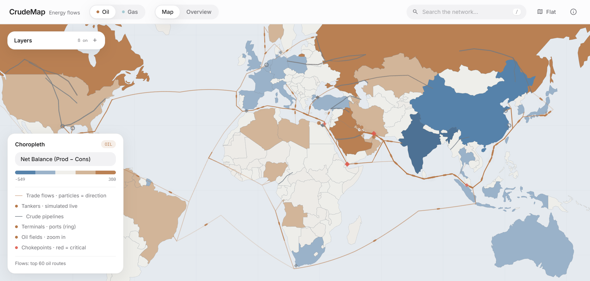
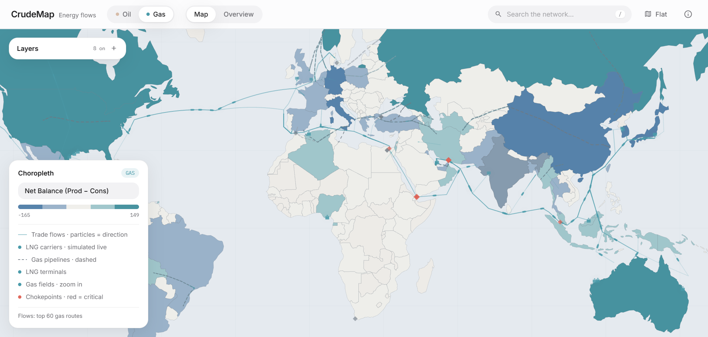
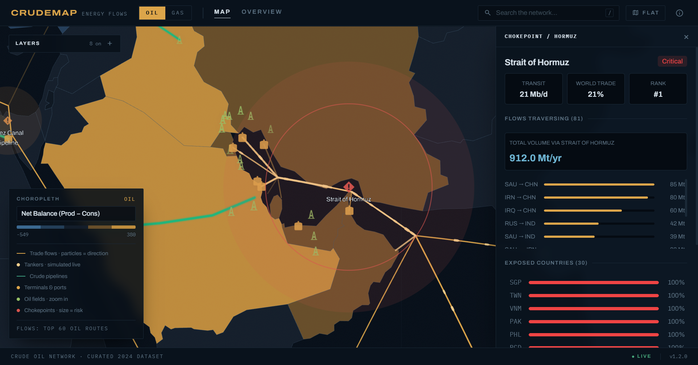
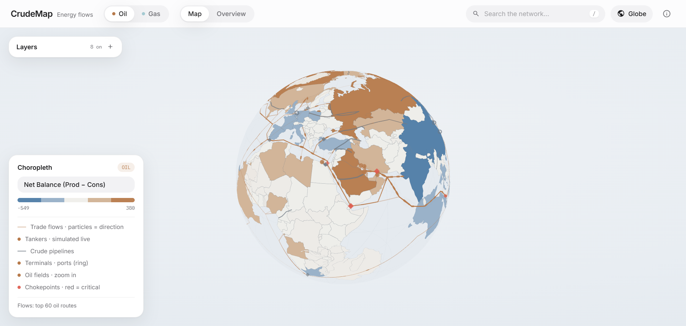
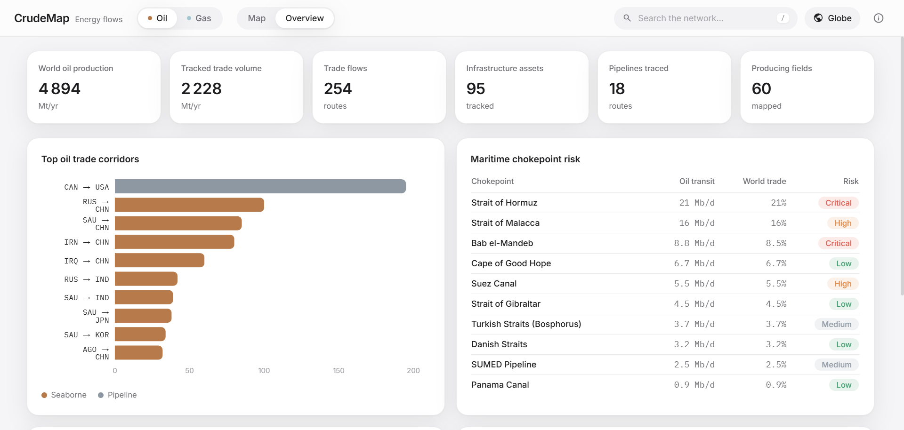

# CrudeMap

**An interactive intelligence map of the world's oil & gas system.**

Trade flows sail real maritime routes between real export and import terminals,
pipelines follow their actual traced paths, a simulated tanker fleet moves live
across the map — all rendered on a fully custom GIS basemap with zero external
tile dependencies.



## Highlights

🛢️ **Two commodities, one switch** — toggle between the crude oil network and
the natural gas network (LNG + pipeline gas). Flows, infrastructure, metrics
and units (Mt/yr ↔ bcm/yr) all follow.

🗺️ **Port-to-port flows on real sea lanes** — every seaborne flow departs the
source country's actual export terminal and docks at the target's import port,
routed with Dijkstra over a curated maritime graph through its real
chokepoints (Hormuz, Malacca, Suez, Bab el-Mandeb, Panama, the Cape…).
Russia ships to Asia from Sakhalin and to Europe from the Baltic — the
departure terminal is picked by destination. Pipeline trade rides the traced
pipeline geometry instead.

🚢 **Live tanker fleet** — named vessels (VLCCs, Suezmaxes, LNG carriers) with
tonnage and cargo sail the routes continuously, oriented by heading, hoverable
for voyage details. Add a free [AISStream.io](https://aisstream.io) API key
(`AISSTREAM_API_KEY`) to overlay **real tankers moving in real time**; when a
vessel sails out of AIS range its marker continues in simulation toward its
declared destination, then snaps back to live when it reappears. No key ⇒
simulated traffic only.

🌍 **Custom GIS basemap** — ocean, graticule, continents and borders are
rendered in-app from GeoJSON. No OSM, no tile server, full visual control —
including a tile-free globe mode.

🎨 **Country choropleth = net balance** — countries are colored by
production − consumption: net exporters in the commodity hue (copper for oil,
teal for gas), net importers in steel blue. Who pumps and who burns, at a
glance.

⚓ **~260 mapped assets** — export/import terminals, refineries, LNG
liquefaction/regas terminals, 70+ producing fields (Ghawar, Permian, North
Field…), 39 pipelines with real traces (Druzhba, ESPO, Nord Stream…), 10
chokepoints with risk levels, plus optional container shipping corridors.

| Natural gas network | Strait of Hormuz detail |
|---|---|
|  |  |

| Tile-free globe | System overview |
|---|---|
|  |  |

## Quick start

Requires Docker + Node 20.

```bash
# 1. Database + API (runs migrations and seeds automatically)
docker compose up -d

# Optional — live AIS tankers (free key from https://aisstream.io):
export AISSTREAM_API_KEY=your_free_key   # then re-run: docker compose up -d

# 2. Frontend
cd frontend
cp .env.example .env
npm install
npm run dev
```


## Using the map

- **Oil | Gas** (header) — switch the whole network
- **Choropleth metric** — selector inside the bottom-left legend (net balance,
  production, consumption, imports, exports, refining, dependency)
- **Layers** (top-left) — per-type toggles with live counts; fields and labels
  appear as you zoom (level-of-detail)
- **Search** (`/`) — countries, terminals, pipelines, fields, chokepoints;
  selecting flies the camera and opens the detail panel
- **Click anything** — countries, terminals, fields, pipelines and chokepoints
  open panels with balances, vulnerability bars, suppliers, route exposure and
  per-record source attribution
- **Flat / Globe** — same fully custom rendering in both projections

## Architecture

```
backend/                    Python 3.11 · FastAPI · PostgreSQL
  app/                      models, schemas, repositories, API routes
  etl/                      seed runner, JSON loaders, validate_seeds,
                            refresh pipeline (EI/JODI/EIA/Comtrade),
                            import_gem (Global Energy Monitor converter)
  scoring/                  dependency / HHI / resilience formulas
  simulation/               NetworkX disruption engine (dormant endpoints)

frontend/                   React 18 · TypeScript · deck.gl 9 · Tailwind
  src/components/Map/       custom GIS basemap, choropleth, flows + particles,
                            vessel fleet, pipelines, fields, infra icons,
                            maritime routing graph (searoutes.ts)
  src/components/           controls, panels, overview dashboard
  public/geo/               static GeoJSON (shipping lanes, container ports)
```

Notable engineering details:

- **Maritime routing graph** ([searoutes.ts](frontend/src/components/Map/searoutes.ts)) —
  ~80 hand-placed sea nodes and corridor edges; flows are routed with Dijkstra
  and forced through their chokepoints, so real shipping lanes emerge visually
  from overlapping routes
- **Globe rendering** ([globeCulling.ts](frontend/src/components/Map/globeCulling.ts)) —
  data layers paint in order with JS hemisphere culling, sidestepping depth
  artifacts from coarse polygons on the sphere
- **Antimeridian-safe geometry** — transpacific routes use unwrapped
  longitudes, no seam artifacts in either projection

## Data

Mixed-vintage public dataset under active refresh. Country oil and gas balances
now ingest official JODI monthly observations for 2026 and expose them as
annualized YTD values with their actual period, source, and confidence. Countries
not yet covered by JODI retain an explicitly labelled EIA International annual
baseline (2025 for oil, 2024 for dry gas). Bilateral 2026 flows combine UN
Comtrade monthly reporter data, Eurostat Comext, EIA U.S. movements, and ENTSOG
daily physical pipeline observations; uncovered routes retain their stated
historical vintage. Older values are never relabelled as 2026. Infrastructure
and routes remain curated from public trackers and operator sources.

### Current 2026 coverage

Snapshot audited on **2026-07-16** against the 177 countries rendered on the
map. “Current” means that the underlying period begins in 2026; older fallback
values remain visible but do not count toward current coverage.

| Dataset | Current coverage |
|---|---:|
| Country rows with an oil and gas profile | 177 / 177 (100%) |
| Oil country profiles using 2026 observations | 59 / 177 (33.3%) |
| Gas country profiles using 2026 observations | 60 / 177 (33.9%) |
| Countries current for both oil and gas profiles | 55 / 177 (31.1%) |
| Countries connected to a 2026 oil flow | 126 / 177 (71.2%) |
| Countries connected to a 2026 gas flow | 103 / 177 (58.2%) |
| Materialized bilateral oil / gas relations | 1,128 / 465 |

The strict reference gate intentionally remains red until every mapped country
has current oil and gas profiles and current bilateral-flow coverage. It is a
completion target, not a claim that unavailable observations are zero.

Validate seeds after editing:

```bash
docker compose run --rm backend python -m etl.validate_seeds
```

Audit progress toward complete, current oil and gas coverage:

```bash
python backend/etl/audit_coverage.py
python backend/etl/audit_coverage.py --strict  # final acceptance gate
```

Refresh the official country snapshots and 2026 bilateral crude/LNG customs
flows. UN Comtrade requires a free API key for complete extraction; the key is
read from the environment and is never written to the generated snapshots.

```bash
cd backend
export COMTRADE_API_KEY=your_free_un_comtrade_key
python -m etl.refresh --eia-international-year 2025 --jodi-oil-year 2026 \
  --jodi-gas --eia-us-flows --eurostat-comext --entsog \
  --eurostat-through-month 6 --entsog-through-month 6 --comtrade-year 2026 \
  --comtrade-through-month 6 --write-seed
```

Without an API key, the official public Preview endpoint is supported with
automatic query splitting below its 500-row cap. Incremental monthly refreshes
avoid losing completed work if the public service throttles a later request:

```bash
python -m etl.refresh --comtrade-year 2026 --comtrade-public-preview \
  --comtrade-from-month 6 --comtrade-through-month 6 --write-seed
```

The source hierarchy, freshness rules, and country-by-country completion plan
are documented in [docs/DATA_STRATEGY.md](docs/DATA_STRATEGY.md). Current source
status is machine-readable in `backend/etl/data/data_manifest.json`.

### Scaling up precision (free public sources)

| What | Source (free) | How |
|---|---|---|
| Pipelines (exact routes), LNG terminals, fields | [Global Energy Monitor trackers](https://globalenergymonitor.org/projects/) | `python -m etl.import_gem --pipelines gem.geojson --lng-terminals gem.csv --fields goget.csv`, then validate + re-seed |
| Country oil & gas balances | JODI and EIA Open Data | `python -m etl.refresh --eia-international-year 2025 --jodi-oil-year 2026 --jodi-gas --write-seed` |
| Bilateral crude and LNG flows | UN Comtrade (HS 2709 and 271111) | set `COMTRADE_API_KEY`, or add `--comtrade-public-preview` for losslessly split keyless extraction |
| EU bilateral crude and LNG flows | Eurostat Comext DS-045409 | add `--eurostat-comext --eurostat-through-month 6`; no key required |
| European physical pipeline gas flows | ENTSOG Transparency Platform | add `--entsog --entsog-through-month 6`; daily data, no key required |
| Live vessel positions | [aisstream.io](https://aisstream.io) (free key) | swap the simulated positions in `vesselFleet.ts` for an AIS websocket |

## Extending

- **New pipeline** — add to `backend/etl/data/pipelines.json` with a
  `geometry` LineString, re-seed
- **New field / LNG terminal** — `fields.json` / `lng_terminals.json`, re-seed
- **New data source** — implement `DataLoader` in `backend/etl/loaders/`
- **Feature flags** — `frontend/src/config/features.ts`
